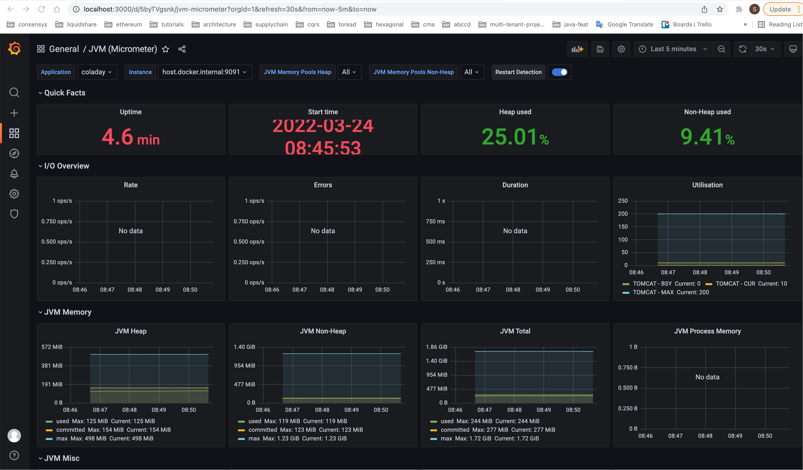

# Cola day: Book your room !


[Boardroom vector created by vectorpocket](https://www.freepik.com/vectors/boardroom)

## Introduction

The goal of this application is to showcase a CRUD application for a booking room system with a 
limited set of requirements, that follows the best practices of modern software development such as:

- [Github actions](https://github.com/features/actions) and [Git hooks](https://git-scm.com/book/en/v2/Customizing-Git-Git-Hooks) for the Continuous integration and Continuous delivery (CI/CD).
- [Docker](https://www.docker.com/) to container application.
- [Kubernetes](https://kubernetes.io/) as a container orchestration system for automating software deployment, scaling, and management.
- [Helm](https://helm.sh/) to package, manage and deploy the application in Kubernetes.
- [Docker-compose](https://docs.docker.com/compose/) to run and test the application with its infrastructure dependencies locally without deploying in Kubernetes.
- [Prometheus](https://prometheus.io/) for event monitoring and alerting.
- [Grafana](https://grafana.com/) for analytics and interactive visualization web application.

## Business problem

The business problem addressed by this application follows this narrative: 

> Two companies, COKE and PEPSI, are sharing an office building. Tomorrow is COLA day (for one day), that the two companies are celebrating.  They are hosting a number of business partners in the building.
> 
>  In order to optimize space utilization, they have decided to set-up a joint booking system where any user can book one of the 20 meeting rooms available, 10 from each company (C01, C02, ... , C10 and P01, P02, .... , P10).
>   
>  The two companies would prefer that they do not  have to use a central booking system for this (as they do not trust each other or anyone else to not take advantage of the situation) - but it’s up to you to decide if you want to implement this functionality or not, and how. 
>  
>  The booking system has the following functionalities: 
>  
> ● Each company has its own room booking front-end  application (note: you may develop only one of them)
>  
>  ● Users can see hourly meeting room availabilities of any of the 20 meeting rooms on COLA day (8am-9am, 9am-10am, etc.)
>  
> ● Users can book meeting rooms by  the hour (first come first served)
> 
> ● Users can cancel their own reservations

## Application

### Build

#### Requirements

- Java 11 or higher is a pre-requisite.
- Docker


#### Git hooks
The application leverages [Git hooks](https://git-scm.com/book/en/v2/Customizing-Git-Git-Hooks)
to keep the commit log consistent by following a conventional message structure with `git-hooks/commit-msg` hook, `git-hooks/pre-commit` and 
`git-hooks/pre-push` hooks by running both unit and integration tests before pushing the code to the remote.

#### Integration tests
The integration tests use [Test Containers](https://www.testcontainers.org/) for testing 
against docker containers to keep a high fidelity and confidence before deploying the 
application in a working environment.

#### Rest API Documentation
The [Rest API documentation](https://selimyanat.github.io/cola-day/) uses [Spring rest docs](https://docs.spring.io/spring-restdocs/docs/2.0.0.RELEASE/reference/html5/#introduction)
to generate the documentation out of the tests. [Github page](https://pages.github.com/) is used as a hosting system for the documentation.  


### Run

#### Requirements

- Docker
- Docker compose
- A version of Kubernetes running locally: Docker for Desktop (Mac or Windows) with Kubernetes support; or MiniKube or K3s (optional)
- Kubernetes client (optional: for kubernetes deployment only)
- Helm 3 or higher (optional: for kubernetes deployment only)

#### With Docker-Compose

Navigate to the `cola-day` source directory then issue the following command:

```
make run-in-docker-compose
```

#### With Kubernetes

Navigate to the `cola-day` source directory then:

- Build and import coladay dependency by running the following command:
```
make build-bitnami-chart
```

- Deploy (or upgrade) the application to kubernetes by running the following command:
```
make deploy-to-kubernetes
```

- Expose the application outside kubernetes by using a port-forward with the following command:
```
export POD_NAME=$(kubectl get pods --namespace coladay -l "app.kubernetes.io/name=coladay-chart,app.kubernetes.io/instance=coladay" -o jsonpath="{.items[0].metadata.name}")
export CONTAINER_PORT=$(kubectl get pod --namespace coladay $POD_NAME -o jsonpath="{.spec.containers[0].ports[0].containerPort}")
kubectl --namespace coladay port-forward $POD_NAME 8080:$CONTAINER_PORT 
```

## Design

Coladay is a self-contained CRUD application based on **Spring Boot** that runs an embedded servlet 
container running by default on port 8080 that expose a **REST API**. The following is a list of the
most important technologies used to develop this application:

 - [Spring boot](https://spring.io/projects/spring-boot): Simple and rapid framework to create simple and web based applications.
 - [Spring data rest](https://projects.spring.io/spring-data-rest/): Spring library that analyzes the entity repositories and expose them as REST resources.
 - [Spring HATEOAS](https://spring.io/projects/spring-hateoas):  Spring library that allows to create REST representation that stick with the principle of HATEOAS *([Hypertext as the Engine of Application State](https://www.wikiwand.com/en/HATEOAS)*)
 - [Spring restdocs](https://docs.spring.io/spring-restdocs/docs/2.0.0.RELEASE/reference/html5/#introduction): Spring library that allows to create api documentation out of tests.
 - [PostgreSQL](https://www.postgresql.org/): PostgreSQL is a powerful, open source object-relational database system.
 - [Liquidbase](https://liquibase.org/): Liquibase is an open-source database-independent library for tracking, managing and applying database schema changes. 
 - [lombok](https://projectlombok.org/) : Framework auto generating code for java (getter, setter, ...).
 - [vavr](http://www.vavr.io): Functional library for java.
 - [Junit 5](https://junit.org/junit5/): The next generation of testing framework for java.
 - [AssertionsJ](http://joel-costigliola.github.io/assertj/): Fluent assertions for java.
 - [Test Containers](https://www.testcontainers.org/): A library for integration testing against docker containers from within Rust
 - [Micrometer](https://micrometer.io/): A library that provides a simple facade over the instrumentation clients for the most popular monitoring systems such as [Prometheus](https://prometheus.io/)

## API

The application requires a user authentication. You can use the users preconfigured in the 
application  (in the database) `user 1` and `user 2` with their corresponding password `password 
1` and `password 2`. You can refer to the API documentation for examples [here](https://selimyanat.github.io/cola-day/) !

## Monitoring and dashboards

If you run the application with `docker-compose` , you can access `Grafana` and `Prometheus`respectively at `http://locahost:3000` and `http://localhost:7070`. The following is a 
screenshot of the application dashboard available in `Grafana` that leverages [Micrometer dashboard](https://grafana.com/grafana/dashboards/4701) for JVM application 
(Java, Spring Boot, Micronaut)



## Limitation

- Deployment of Grafana and Prometheus in Kubernetes is not yet supported