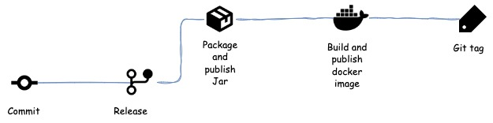

[](https://sonarcloud.io/summary/new_code?id=selimyanat_cola-day)


# Cola day: Book your room !


[Boardroom vector created by vectorpocket](https://www.freepik.com/vectors/boardroom)

## Introduction

The goal of this application is to showcase a CRUD application for a booking room system with a 
limited set of requirements, that follows the best practices of modern software development such as:

- Continuous integration and Continuous delivery (CI/CD): [Github actions](https://github.com/features/actions) and [Git hooks](https://git-scm.com/book/en/v2/Customizing-Git-Git-Hooks) 
- Catch bugs and security vulnerabilities: [SonarCloud](https://sonarcloud.io/) and [Github dependabot](https://github.com/dependabot)
- Application containerization and orchestration: [Docker](https://www.docker.com/), 
  [Docker-compose](https://docs.docker.com/compose/), [Kubernetes](https://kubernetes.io/), 
  [Helm](https://helm.sh/)
- Observability:[Prometheus](https://prometheus.io/) and [Grafana](https://grafana.com/)


## Business problem

The business problem addressed by this application follows this narrative: 

> Two companies, COKE and PEPSI, are sharing an office building. Tomorrow is COLA day (for one day), that the two companies are celebrating.  They are hosting a number of business partners in the building.
> 
>  In order to optimize space utilization, they have decided to set-up a joint booking system where any user can book one of the 20 meeting rooms available, 10 from each company (C01, C02, ... , C10 and P01, P02, .... , P10).
>   
>  The two companies would prefer that they do not  have to use a central booking system for this (as they do not trust each other or anyone else to not take advantage of the situation) - but it’s up to you to decide if you want to implement this functionality or not, and how. 
>  
>  The booking system has the following functionalities: 
>  
> ● Each company has its own room booking front-end  application (note: you may develop only one of them)
>  
>  ● Users can see hourly meeting room availabilities of any of the 20 meeting rooms on COLA day (8am-9am, 9am-10am, etc.)
>  
> ● Users can book meeting rooms by  the hour (first come first served)
> 
> ● Users can cancel their own reservations

## Continuous Integration

**Important**

- [Git hooks](https://git-scm.com/book/en/v2/Customizing-Git-Git-Hooks) is used to keep the commit log consistent by following a conventional message structure with `git-hooks/commit-msg` hook, `git-hooks/pre-commit` and
`git-hooks/pre-push` hooks by running both unit and integration tests before pushing the code to the remote.

- [Jgitver](https://github.com/jgitver/jgitver) is used to automatically compute the version of your project leveraging 
the git history. It does not pollute the project’s git history like the maven release plugin. 

- The [Rest API documentation](https://selimyanat.github.io/cola-day/) uses [Spring rest docs](https://docs.spring.io/spring-restdocs/docs/2.0.0.RELEASE/reference/html5/#introduction)
to generate the documentation out of the tests. [Github page](https://pages.github.com/) is used as a hosting system for the documentation.


### Feature


### Release



## Design

Coladay is a self-contained CRUD application based on **Spring Boot** that runs an embedded servlet
container that expose a **REST API**. The following is the technology stack used to develop this 
application:

**Support of Grafana and Prometheus is only supported with Dockcer-compose**


## API

The application requires a user authentication. You can use the users accounts preconfigured in the
application (in the database) `user 1` and `user 2` with their corresponding password `password
1` and `password 2`. You can refer to the API documentation [here](https://selimyanat.github.io/cola-day/) !

## Run

### With Docker-Compose

Navigate to the `cola-day` source directory then issue the following command:

```
make run-in-docker-compose
```

### With Kubernetes

Navigate to the `cola-day` source directory then:

- Build and import coladay dependency by running the following command:
```
make build-bitnami-chart
```

- Deploy (or upgrade) the application to kubernetes by running the following command:
```
make deploy-to-kubernetes
```

- Expose the application outside kubernetes by using a port-forward with the following command:
```
export POD_NAME=$(kubectl get pods --namespace coladay -l "app.kubernetes.io/name=coladay-chart,app.kubernetes.io/instance=coladay" -o jsonpath="{.items[0].metadata.name}")
export CONTAINER_PORT=$(kubectl get pod --namespace coladay $POD_NAME -o jsonpath="{.spec.containers[0].ports[0].containerPort}")
kubectl --namespace coladay port-forward $POD_NAME 8080:$CONTAINER_PORT 
```

## Monitoring and dashboards

If you run the application with `docker-compose` , you can access `Grafana` and `Prometheus`respectively at `http://locahost:3000` and `http://localhost:7070`. The following is a 
screenshot of the application dashboard available in `Grafana` that leverages [Micrometer dashboard](https://grafana.com/grafana/dashboards/4701) for JVM application 
(Java, Spring Boot, Micronaut)


